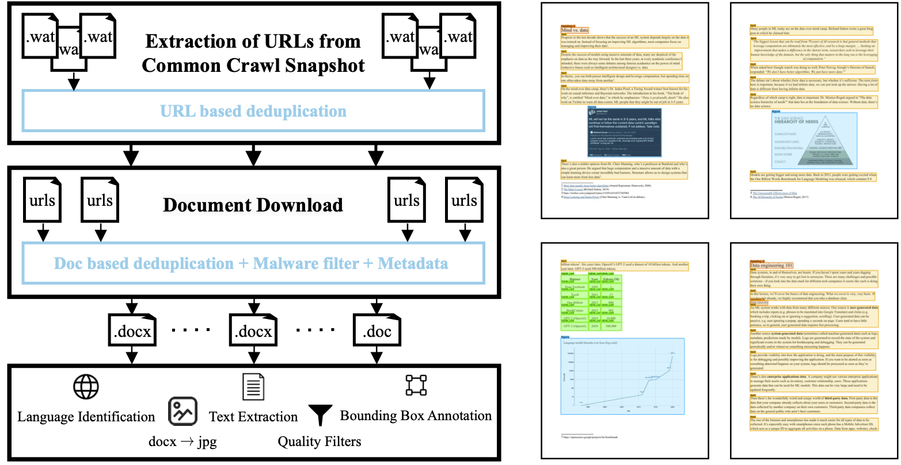

# WordScape: a Pipeline to extract multilingual, visually rich Documents with Layout Annotations from Web Crawl Data

This repository contains a pipeline to extract Word documents from the web, render page images, extract the text and
generate bounding box annotations for semantic entities.



# Document urls

You can download a list of 9.4M urls, including the SHA256 checksums of the associated documents from
[here](https://drive.google.com/file/d/1N73BnRaErjEe-_G3hzixhDR0cwOUTHNI/view). Using this list, you can skip the step
of parsing commoncrawl, and directly download the documents and verify their integrity.

| CommonCrawl Snapshot | Number of URLs | Download Link                                                                                  |
|----------------------|----------------|------------------------------------------------------------------------------------------------|
| 2013-48              | 57,150         | [Download](https://drive.google.com/file/d/1359HSlQighPkMV3iEf_z6pO5rdknZhJ_/view?usp=sharing) |
| 2016-50              | 309,734        | [Download](https://drive.google.com/file/d/14_YuQeu6S0u2lKYKOcpEy5AUjmvSeQdE/view?usp=sharing) |
| 2020-40              | 959,098        | [Download](https://drive.google.com/file/d/1hKFv4gkUqV_cJcR-02J7rbVm2vJ8HRHH/view?usp=sharing) |
| 2021-43              | 1,424,709      | [Download](https://drive.google.com/file/d/1wuXzQ6RKmV56RldqRImbbbHnnza7GSpF/view?usp=sharing) |
| 2023-06              | 3,009,335      | [Download](https://drive.google.com/file/d/1mKWK79_M_ENGJy781tPUCtsNJtuoxu5d/view?usp=sharing) |
| 2023-14              | 3,658,202      | [Download](https://drive.google.com/file/d/15Od3TdMrkondhfyCNCBSxijXbuyq5rz3/view?usp=sharing) |
| all                  | 9,418,228      | [Download](https://drive.google.com/file/d/1N73BnRaErjEe-_G3hzixhDR0cwOUTHNI/view?usp=sharing) |

# Pipeline Overview

The WordScape pipeline consists of three core steps and makes extensive use of the Open XML structure of Word documents.
The first step is to extract links to Word files from the Common Crawl web corpus. In the second step, the Word
documents are downloaded through HTTP requests. In the third third step, we process processing them to create a
multimodal dataset with page images, text, and bounding box annotations for semantic entities like headings and tables.
Here we briefly describe the three steps of the pipeline and refer to the instructions for each individual step for more
details.

## Common Crawl Parsing

The initial step in the WordScape pipeline involves extracting URLs pointing to Word files from Common Crawl snapshots,
utilizing metadata files to select HTTP URLs ending in .doc or .docx. The parsed URLs are subsequently merged,
deduplicated on a per-snapshot basis, and globally deduplicated across all previously processed snapshots. The output
of this step of the pipeline is a list of URLs stored as a parquet file.

You find more details on how to run this step of the pipeline in
the [Common Crawl Parsing README](README_CC_URL_PARSE.md).

## Document Download

In this stage of the WordScape pipeline, documents are downloaded from extracted URLs, with rejections based on various
criteria such as HTTP errors, invalid formats, potentially malicious features, and excessive file sizes. Upon successful
download, metadata fields including HTTP status, OLE information, and a SHA-256 hash of the response are saved to
analyze and ensure content integrity.

You find more details on how to run this step of the pipeline in
the [Document Download README](README_DOWNLOAD.md).

## Document Annotation

In the processing of downloaded Word documents consists, we identify the language using FastText, render document pages
as jpeg using [LibreOffice](https://www.libreoffice.org/) and [PDF2Image](https://github.com/Belval/pdf2image), generate
bounding box annotations and extract text using [Python-docx](https://github.com/python-openxml/python-docx)
and [PDFPlumber](https://github.com/jsvine/pdfplumber).

You find more details on how to run this step of the pipeline in
the [Document Annotation README](README_ANNOTATION.md).

## Extensions & Model Training

To further refine the dataset, we provide tools to filter the raw dataset with respect to which entity categories
should be present in the dataset, the number of entities for each category, the language, as well as the language score
and quality score. In addition, we also provide scripts to train a YOLOv5l model on the dataset.

You find more details related to the pipeline extensions and model training in
the [Extensions README](README_EXTENSIONS.md).

# Setup

This pipeline has been successfully tested on both MacOS and Linux Ubuntu and CentOS. We recommned working with a
virtual environment to manage python dependencies. Make sure you run the following steps from the root folder of this
repository.

_Note that this pipeline has only been tested with Python 3.8._

1. Create or symlink the `data` folder. This folder will be used to store the output of the pipeline. If you want to
   symlink the folder, you can use the following command:

```shell
ln -s /path/to/your/data/folder data
```

2. Create a virtual environment and activate it:

```shell
python -m venv .venv
source .venv/bin/activate
```

3. Install the python dependencies:

```shell
pip install -r requirements.txt
```

4. Download the FastText language classifier

```shell
curl https://dl.fbaipublicfiles.com/fasttext/supervised-models/lid.176.bin -o resources/fasttext-models/lid.176.ftz
```

5. Install LibreOffice and Unoserver. See the sections below for detailed instructions. These dependencies are required
   in the annotation step of the pipeline to 1) convert `.doc` to `.docx` and 2) convert `.docx` to PDF.

## LibreOffice and Unoserver Installation

### Linux Ubuntu

#### LibreOffice

Version 7.4.6 (LTS) is supported. Follow installation instructions
from https://www.libreoffice.org/download/download-libreoffice/. Take care of the README in the libreoffice instruction
files for your distribution!

Double check the correctness of your path: run

```shell
whereis soffice
```

example output:

```shell
soffice: /opt/libreoffice7.4/program/soffice
```

In your bash profile:

```shell
export PATH=$PATH:/opt/libreoffice7.4/program
```

#### Unoserver

We provide a step-by-step guide to install unoserver on Ubuntu here. For more details, see
the [Unoserver Github repository](https://github.com/unoconv/unoserver).

```shell
sudo apt-get install python3-uno
```

In your bash profile:

```shell
export PYTHONPATH=${PYTHONPATH}:/usr/lib/python3/dist-packages/
```

run:

```shell
whereis uno.py
```

example output:

```shell
uno.py: /opt/libreoffice7.4/program/uno.py
```

In your bash profile (if not already completed in LibreOffice installation step):

```shell
export PATH=$PATH:/opt/libreoffice7.4/program
```

### MacOS

#### LibreOffice

Check the guides on https://www.libreoffice.org/get-help/install-howto/ for installation instructions.

Alternatively, you can also install LibreOffice via Homebrew, using the following command:

```shell
brew install --cask libreoffice
```

To test the installation was successful, you can convert a document from docx to pdf using the following command:

```shell
soffice --headless --convert-to pdf /path/to/docs/document1.docx --outdir .
```

#### Unoserver

We provide a step-by-step guide to install unoserver on MacOS here (tested with MacOS Ventura). For more details, see
the [Unoserver Github repository](https://github.com/unoconv/unoserver).

Unoserver needs to run with the python installation used by LibreOffice. You can install unoserver via:

```shell
/Applications/LibreOffice.app/Contents/Resources/python -m pip install unoserver
```

You need the two executables `unoserver` and `unoconvert` to convert docx to pdfs. On Mac, they should be located in
`/Applications/LibreOffice.app/Contents/Frameworks/LibreOfficePython.framework/bin/`. To check if it works, run

```shell
/Applications/LibreOffice.app/Contents/Frameworks/LibreOfficePython.framework/bin/unoserver
```

If this throws an error, it is possibly due to the shebang line pointing to a python installation which does not have
uno libraries installed. If so, replace it with the python installation used by LibreOffice:

```shell
#!/Applications/LibreOffice.app/Contents/Resources/python
```

The same applies to the `unoconvert` executable.

### Linux CentOS

On CentOS, you can install LibreOffice and unoserver without root access using the
script `install_libreoffice_centos.sh` in the `scripts` folder:

```shell
bash scripts/install_libreoffice_centos.sh
``` 

To check that unoserver is installed correctly, run `which unoserver` and `which unoconv`. Both should return a path
to the binaries.

# Citation

If you find the paper and the pipeline code useful, please consider citing us:

```
@inproceedings{wordscape,
  author={Weber, Maurice and Siebenschuh, Carlo and Butler, Rory Marshall and Alexandrov, Anton and Thanner, Valdemar Ragnar and Tsolakis, Georgios and Jabbar, Haris and Foster, Ian and Li, Bo and Stevens, Rick and Zhang, Ce},
  booktitle = {Advances in Neural Information Processing Systems},
  title={WordScape: a Pipeline to extract multilingual, visually rich Documents with Layout Annotations from Web Crawl Data},
  year={2023}
}
```

# License

By contributing to this repository, you agree to license your work under the license specified in the LICENSE file.

